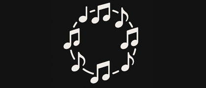
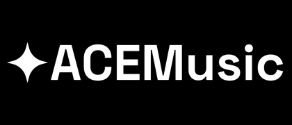
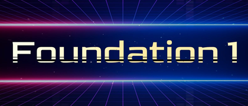
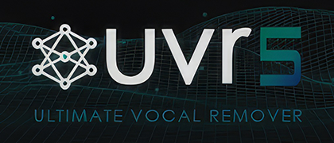

<div align="center">
  
</div>

# K.G.One Music Studio

> **AI-native music creation. Compose, generate, and produce — right in your browser.**


<div align="center">
  
</div>

---

## What is K.G.One Music Studio?

**K.G.One Music Studio** is an AI-powered music production platform built entirely on open-source software. It combines [K.G.Studio](https://github.com/KGAudioLab/K.G.Studio), a lightweight browser-based DAW, with **K.G.One**, a local AI backend that brings generative music tools into your workflow.

Every integrated component is open source, and the full stack can run locally on your own machine. Open K.G.Studio in any modern browser, connect it to your K.G.One server, and you can generate full songs from text, produce MIDI clips and WAV loops, or separate a track into clean stems without leaving the browser.

K.G.Studio ships with a built-in **AI Musician Assistant** for harmony, arrangement, and note editing through natural conversation. K.G.One extends the DAW with a dedicated **K.G.One Music Generator** panel — GPU-accelerated tools for generating full songs, producing MIDI clips, and separating stems, all accessible directly from the browser interface.

Both **K.G.Studio** and **K.G.One Music Studio** are built by the same author. K.G.One Music Studio also integrates three open-source third-party components: **ACE-Step 1.5** for full-song generation, **Foundation-1** for audio clip generation, and **python-audio-separator** for stem separation.

---

## Components

| | Component | Capabilities |
|--|-----------|-------------|
|  | [**K.G.Studio**](https://github.com/KGAudioLab/K.G.Studio) | Browser-based DAW — compose, edit, and produce in any modern browser |
|  | [**ACE-Step 1.5**](https://github.com/ace-step/ACE-Step-1.5) | Generate full-length songs from text prompts |
|  | [**Foundation-1**](https://huggingface.co/RoyalCities/Foundation-1) | Generate instrument clips and MIDI loops from text |
|  | [**python-audio-separator**](https://github.com/nomadkaraoke/python-audio-separator) | Separate any audio into vocals, instrumental, and more |

> **Note:** All AI models require a CUDA-enabled GPU. Apple Silicon support is coming soon.

---

## How It Works

K.G.One Music Studio is built from five parts: K.G.Studio, K.G.One, ACE-Step 1.5, Foundation-1, and python-audio-separator.

**K.G.Studio** is the main interface. It runs entirely in the browser, stores projects locally, and can be used as a standalone DAW without any server. You can try it here: [https://kgaudiolab.github.io/kgstudio/](https://kgaudiolab.github.io/kgstudio/). It also includes an AI Musician Assistant for harmony, arrangement, and note editing through natural-language interaction. That assistant requires access to a modern LLM, which can also be hosted locally with open-source tools such as Ollama, vLLM, or llama.cpp. Model quality and editing performance can vary significantly, and not all models perform equally well. For local hosting, we recommend **qwen3.5-35b-a3b**. Additional recommended commercial and free LLM options are listed in the [K.G.Studio README](https://github.com/KGAudioLab/K.G.Studio). When K.G.Studio connects to a K.G.One server, the **K.G.One Music Generator** panel becomes available inside the DAW, so song generation, clip generation, and stem separation stay part of the same workflow.

**K.G.One** provides a single local API layer between K.G.Studio and the three integrated AI services. It routes requests to the correct backend, manages model startup and shutdown, and keeps the browser interface consistent across different generation tasks. When you switch models through the API, K.G.One stops the active service before loading the next one. This helps free GPU memory and avoids conflicts between services with different runtime dependencies.

---

## Requirements

| Requirement | Notes |
|-------------|-------|
| Windows 10/11 or Linux | Use `init.bat` on Windows, `init.sh` on Linux |
| NVIDIA GPU | CUDA required for all AI models (VRAM >= 8GB), Apple Silicon support is coming soon. |
| [Git](https://git-scm.com/downloads) | For cloning sub-projects |
| [uv](https://docs.astral.sh/uv/getting-started/installation/) | Python environment manager |
| nvm ([Windows](https://github.com/coreybutler/nvm-windows/releases) / [Linux](https://github.com/nvm-sh/nvm)) | Node.js version manager (for building K.G.Studio) |
| [jq](https://jqlang.org/download/) | JSON parser — Linux only (e.g. `sudo apt install jq`) |
| Python 3.10 | Required by Foundation-1; ACE-Step works with 3.10+ |

---

## Setup

### 1. Initialize

Run the init script from the project root. It will:

1. Read pinned commit hashes and URLs from `submodules.json`
2. Clone (or update) ACE-Step 1.5 → `ace-step/`
3. Clone (or update) Foundation-1 → `foundation1/`
4. Clone (or update) python-audio-separator → `separator/`
5. Clone (or update) K.G.Studio, install Node dependencies, and build the SPA → `kgstudio/dist/`
6. Clone (or update) soundfonts → `soundfonts/`
7. Create four isolated Python environments:
   - `.venv` — K.G.One server (fastapi, httpx)
   - `ace-step/.venv` — ACE-Step and its CUDA dependencies
   - `foundation1/.venv` — Foundation-1 (Python 3.10, scipy==1.8.1)
   - `separator/.venv` — python-audio-separator (GPU)
8. Create output and upload directories
9. Download ACE-Step and Foundation-1 model weights

**Windows:**
```bat
init.bat
```

**Linux:**
```bash
./init.sh
```

> **Note:** The first run downloads large runtime packages and model weights (several GB total). How long it takes depends on your network speed and machine — subsequent runs skip already-completed steps.

### 2. Start K.G.One Music Studio

**Windows:**
```bat
uv run .\main.py
```

**Linux:**
```bash
uv run ./main.py
```

The server starts on `http://localhost:8000` and automatically opens K.G.Studio in your browser.

To allow access from other devices on your network:

```bash
uv run ./main.py --host 0.0.0.0
uv run ./main.py --host 0.0.0.0 --port 8080
```

---

## Using K.G.One Music Studio

**K.G.Studio is the recommended way to use K.G.One Music Studio.** It opens automatically in your browser when the server starts and covers every capability through a visual interface.

**K.G.One Music Generator panel** (requires K.G.One server):
- **Generate a full song** — describe the mood, genre, and style; get back a full-length audio track
- **Generate MIDI clips + WAV loops** — produce instrument loops that land directly on your tracks, ready to edit in the piano roll
- **Separate stems** — split any audio file into vocals, instrumentals, or individual instruments

**K.G.Studio Musician Assistant** (works standalone, no K.G.One needed, requires an external LLM service):
- Arrange, edit, and compose using the AI chat panel — describe what you want and the assistant makes edits directly in the project

> AI generation tools (full song, clip, stem separation) will be integrated into the Musician Assistant in a future release.

> **First time?** Head to [K.G.Studio's Quick Start guide](https://github.com/KGAudioLab/K.G.Studio#quick-start) to set up the AI assistant, or read the full [K.G.Studio User Guide](https://github.com/KGAudioLab/K.G.Studio/blob/main/docs/USER_GUIDE.md) for a complete walkthrough.

---

## For Developers

If you want to call the AI features programmatically, integrate K.G.One into your own tooling, or explore what's under the hood:

- **[API Reference →](./docs/API.md)** — full REST API documentation with request/response examples for all endpoints
- **Interactive Swagger UI** — `http://localhost:8000/docs` (available while the server is running)

---

## Contributing

K.G.One Music Studio is an experimental, actively evolving project — contributions are very welcome! Whether you're a developer, musician, or designer, your expertise can make a real difference.

### How You Can Help

**🎵 Musicians & Music Producers**
- Test the platform with real-world music production workflows
- Provide feedback on generation quality and integration with K.G.Studio
- Suggest AI models or features that would improve your creative process
- Help improve prompting guides for ACE-Step and Foundation-1

**💻 Developers**
- Implement new features from the roadmap
- Fix bugs and improve performance
- Add support for new AI models or stem separation models
- Improve Linux/macOS compatibility
- Work on K.G.Studio's AI Musician Assistant capabilities

**🎨 UI/UX Designers**
- Improve the K.G.Studio DAW interface and workflows
- Design better visual feedback for generation and separation tasks
- Create more intuitive interactions for AI-assisted music production

### Get Involved

- **Email:** [kgstudio@duck.com](mailto:kgstudio@duck.com)
- **Issues:** Browse open issues labeled `help wanted` or `good first issue`
- **Discussions:** Share ideas and feedback in GitHub Discussions

No contribution is too small — from reporting bugs to suggesting new features, every bit of help moves the project forward!

---

## License

K.G.One Music Studio is licensed under the [Apache License 2.0](./LICENSE) with two supplemental conditions:

- **No patents** — this software may not be used to file or support any patent application in any jurisdiction.
- **Attribution** — public or commercial deployments must display `Powered by K.G.One © 2026 Xiaohan Tian` in a prominent location visible to end users.

### Third-party component licenses

K.G.One Music Studio integrates or proxies the following projects. If you use the corresponding features, you are responsible for complying with their licenses.

| Component | Used for | License | Notes |
|-----------|----------|---------|-------|
| [K.G.Studio](https://github.com/KGAudioLab/K.G.Studio) | Browser DAW UI | Apache 2.0 + custom terms | Public/commercial use requires displaying `Powered by K.G.Studio © 2025-2026 Xiaohan Tian`; no patent filing permitted |
| [ACE-Step 1.5](https://github.com/ace-step/ACE-Step-1.5) | Full-song generation (`/v1/fullsong/*`) | MIT | Permissive — attribution required |
| [stable-audio-open-1.0](https://huggingface.co/stabilityai/stable-audio-open-1.0) | Clip generation (`/v1/clip/*`) via Foundation-1 | Stability AI Community License | **Non-commercial only.** Commercial use requires a separate license from Stability AI — see [stability.ai/license](https://stability.ai/license) |
| [python-audio-separator / UVR5](https://github.com/nomadkaraoke/python-audio-separator) | Stem separation (`/v1/separator/*`) | MIT | Permissive — attribution required |

> **Note:** The `clip` generation feature is powered by a model released under the Stability AI Community License, which **does not permit commercial use**. If you intend to use K.G.One Music Studio in a commercial product, you must obtain a commercial license from Stability AI before enabling or exposing the `/v1/clip/*` endpoints.

See [LICENSE](./LICENSE) for the full terms including third-party notices.
